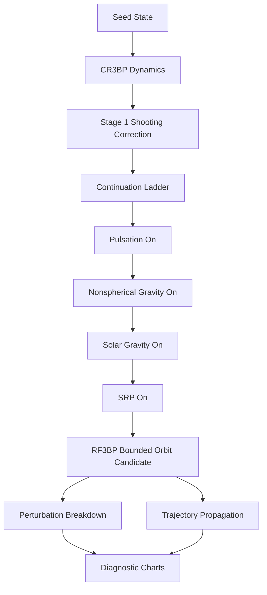
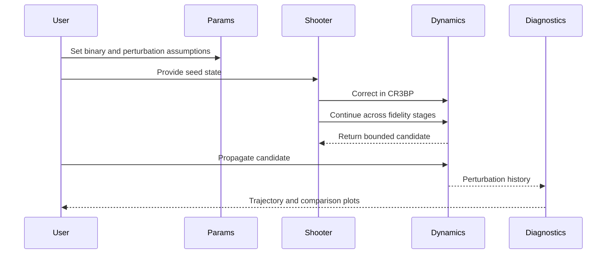

# Moshup-Squannit RF3BP Lab


Research-oriented Python project for experimenting with bounded spacecraft motion near the binary asteroid system **Moshup-Squannit (1999 KW4)** using a **restricted full three-body problem inspired** formulation in a **pulsating-rotating frame**.

This repository does not try to be a CLI-heavy wrapper. The main value is the **dynamics code**, the **hierarchical shooting continuation logic**, and the **diagnostic plots** that help compare perturbation sources in the neighborhood of a binary asteroid.

> [!IMPORTANT]
> The journal paper linked in the original request is paywalled from this environment. This repository therefore implements a technically consistent, abstract-level RF3BP research sandbox derived from the paper's public abstract and standard CR3BP/RF3BP practice, not a line-by-line reproduction of copyrighted equations.

## What This Solves

Classical CR3BP is useful for intuition, but it misses the exact effects that become important around a small binary asteroid:

- the primary-secondary distance can pulsate instead of staying fixed
- body shapes are not spherical
- the Sun perturbs the local binary dynamics
- solar radiation pressure matters for low-mass spacecraft
- orbit design methods that work in CR3BP can break when fidelity increases

This project gives you a compact environment to answer questions like:

- How much does pulsation change a bounded orbit relative to a CR3BP reference?
- Is pulsation weaker or stronger than the nonspherical gravity correction along a candidate path?
- Can a seed orbit from a lower-fidelity model be continued into a more realistic one?
- Which perturbation dominates at a given point in the trajectory?

## Executive Summary

| Topic | What It Is | What It Does | Why It Matters |
| --- | --- | --- | --- |
| CR3BP baseline | Circular restricted 3-body model in a rotating frame | Supplies a low-cost reference orbit model | Good starting point for initial guesses |
| RF3BP-inspired dynamics | Higher-fidelity pulsating-rotating model | Adds pulsation, nonspherical gravity, solar gravity, and SRP | Closer to binary-asteroid mission reality |
| Potential-derivative kinematics | Secondary relative acceleration and jerk estimate from a potential derivative view | Explicitly models nonuniform pulsation terms | Makes pulsation effects visible in the equations |
| Hierarchical continuation | Staged shooting from CR3BP to higher fidelity | Transfers a seed orbit across models | Avoids solving the hardest model from scratch |
| Diagnostics | Trajectory and perturbation plots | Shows which effects dominate and where | Useful for analysis, papers, and design iteration |

## RF3BP vs CR3BP - What Is The Difference?

CR3BP and RF3BP are not competing "brands" of the same equation - they represent different physical assumptions.

| Aspect | CR3BP | RF3BP (this lab) | Practical Consequence |
| --- | --- | --- | --- |
| Primary-secondary distance | Constant | Time-varying (pulsating) | Adds nonuniform frame terms and shifts equilibrium structure |
| Gravity field shape | Point masses only | Point masses + J2-like nonspherical corrections | Local accelerations can deviate strongly near bodies |
| External forcing | None | Solar third-body differential gravity + SRP | Long-time bounded motion is more sensitive |
| Frame model | Uniform rotating frame | Pulsating-rotating frame with explicit pulsation terms | CR3BP intuition can fail as fidelity increases |
| Design workflow | Often direct periodic-orbit correction | Hierarchical continuation from low to high fidelity | Better robustness when full model is stiff |

In the rotating frame, the CR3BP acceleration can be summarized as

$$
\ddot{\mathbf{r}}_{CR3BP} = \nabla \Omega(\mathbf{r}) - 2\,\boldsymbol{\omega} \times \dot{\mathbf{r}}
$$

while the RF3BP-inspired model used here is

$$
\ddot{\mathbf{r}}_{RF3BP} = \ddot{\mathbf{r}}_{CR3BP}
+ \mathbf{a}_{pulsation}
+ \mathbf{a}_{nonspherical}
+ \mathbf{a}_{solar}
+ \mathbf{a}_{SRP}
$$

The new code-level metric in this repository computes the instantaneous gap

$$
\Delta \mathbf{a} = \ddot{\mathbf{r}}_{RF3BP} - \ddot{\mathbf{r}}_{CR3BP},
\quad
\rho = \frac{\|\Delta \mathbf{a}\|}{\|\ddot{\mathbf{r}}_{CR3BP}\|}
$$

This gives a direct, quantitative answer to "how far from CR3BP" a trajectory point is.

## Visual Outputs

### RF3BP vs CR3BP

| CR3BP Reference | RF3BP Higher Fidelity |
| --- | --- |
|  |  |

### Perturbation Diagnostics

| Perturbation Magnitudes | Continuation Convergence |
| --- | --- |
|  |  |

### Model Difference Diagnostics

| RF3BP vs CR3BP Gap History |
| --- |
|  |

> [!NOTE]
> The figures above are generated from the repository's current model and default parameters. They are useful for comparative algorithm work, not for claiming flight-certified truth.

## System Architecture



## Model Fidelity Ladder

| Stage | Enabled Physics | Purpose | Computational Role |
| --- | --- | --- | --- |
| 0 | CR3BP only | Correct the seed in the simplest useful model | Fast, stable initialization |
| 1 | Pulsation | Turn on nonuniform separation effects | Measures the cost of leaving circular assumptions |
| 2 | Pulsation + nonspherical gravity | Add J2-like gravity corrections | Introduces body-shape-driven local distortion |
| 3 | Pulsation + nonspherical gravity + solar gravity | Add differential third-body forcing | Captures long-baseline solar perturbation |
| 4 | Full model + SRP | Add light-pressure acceleration | Approximates small-spacecraft sensitivity |

## Core Algorithms

### 1. CR3BP Baseline Dynamics

The repository keeps a standard rotating-frame CR3BP model as the reference surface for orbit seeding and comparison.

### 2. RF3BP-Inspired Pulsating-Rotating Dynamics

The higher-fidelity model in `src/rf3bp_lab/dynamics/models.py` combines:

- point-mass gravity from both binary bodies
- J2-style nonspherical gravity corrections for both bodies
- time-varying primary-secondary separation
- pulsation inertial correction terms
- third-body solar gravity
- solar radiation pressure

The same module now includes a direct comparison utility that computes acceleration-level mismatch between the CR3BP and RF3BP equations at any state and time.

### 3. Potential-Derivative Relative Kinematics

The code computes relative secondary kinematics from a potential-derivative perspective:

- relative position vector
- relative velocity vector
- relative acceleration vector
- relative jerk vector

This is the project’s direct answer to the request to stop centering the work on CLI and focus on the actual dynamical machinery.

### 4. Hierarchical Shooting Continuation

The continuation algorithm does not brute-force the full model from scratch. It follows a staged process:


The current implementation uses an explicit bounded, damped Newton-style corrector with finite-difference Jacobians under controlled tolerances. That replaced a much slower optimizer-driven solve path that caused test timeouts.

## What Is Implemented vs What Is Approximated

| Area | Current Implementation | Why This Choice Was Made | Upgrade Path |
| --- | --- | --- | --- |
| Binary geometry | Normalized separation with pulsation law | Keeps the frame mechanics explicit and inspectable | Replace with shape/ephemeris-driven relative motion |
| Nonspherical gravity | J2-like correction for both bodies | Lightweight proxy for body asymmetry | Polyhedral gravity from shape models |
| Solar perturbation | Simplified moving-Sun differential gravity | Good comparative forcing term | SPICE or ephemeris-driven Sun state |
| SRP | Constant-magnitude directional SRP | Lets perturbation ranking be studied quickly | Area-to-mass, attitude, eclipse, optical model |
| Continuation | Single-shooting staged correction | Small code footprint, good for experimentation | Multi-shooting and collocation |

## Why These Methods Fit This Problem

| Method | Why It Fits Moshup-Squannit Orbit Studies | Main Limitation |
| --- | --- | --- |
| CR3BP seed generation | Gives a structured initial orbit family around a binary system | Ignores pulsation and realistic perturbations |
| Pulsating-rotating frame | Directly expresses time-varying mutual separation effects | Requires care when comparing against static-frame intuition |
| J2-like gravity proxy | Cheap way to inject dominant nonspherical trends | Too simple for strongly irregular bodies |
| Hierarchical continuation | Practical way to migrate a low-fidelity orbit into higher fidelity | Can still fail if the seed is too weak |
| Perturbation breakdown plots | Turns model complexity into interpretable evidence | Diagnostic, not an optimization method |

## Alternatives Compared

| Approach | Strengths | Weaknesses | When To Use It Instead |
| --- | --- | --- | --- |
| Pure CR3BP | Fast, interpretable, classical | Too idealized for close binary-asteroid work | Early concept design or teaching |
| This repository | Good balance between insight and implementation cost | Several effects are still approximated | Algorithm research and rapid trade studies |
| Full polyhedral gravity + SPICE + eclipse + attitude model | Highest physical fidelity | Much more data and engineering overhead | Mission-grade analysis and detailed navigation studies |
| Direct black-box optimization in full fidelity | Can find solutions missed by continuation | Expensive and brittle without good seeds | Late-stage global search after good priors exist |

## Repository Map

| Path | What It Is | What It Does |
| --- | --- | --- |
| `src/rf3bp_lab/dynamics/params.py` | Parameter container | Holds normalized and physical scale assumptions |
| `src/rf3bp_lab/dynamics/models.py` | Core dynamics engine | Implements CR3BP, RF3BP-inspired dynamics, perturbation breakdown, and propagation |
| `src/rf3bp_lab/shooting/hierarchical.py` | Continuation solver | Performs staged bounded-orbit correction across model fidelity levels |
| `src/rf3bp_lab/utils/plotting.py` | Visualization utilities | Builds trajectory and perturbation charts |
| `scripts/run_demo.py` | End-to-end demo | Runs continuation, propagation, and plot generation |
| `tests/` | Validation layer | Confirms basic dynamics and shooter behavior |
| `docs/figures/` | Generated artifacts | Stores README-embeddable charts |

## Default Moshup-Squannit Assumptions

The defaults are intentionally transparent and easy to refine.

| Parameter | Default | Meaning |
| --- | --- | --- |
| `mu` | `0.02` | Normalized binary mass ratio used by the sandbox |
| `r12_mean_m` | `2500.0` m | Mean mutual separation |
| `pulsation_e` | `0.08` | Pulsation amplitude parameter |
| `pulsation_nu` | `0.35` | Pulsation frequency scale |
| `j2_primary` | `0.05` | J2-like primary gravity coefficient |
| `j2_secondary` | `0.02` | J2-like secondary gravity coefficient |
| `r_primary_m` | `700.0` m | Primary scale radius |
| `r_secondary_m` | `225.0` m | Secondary scale radius |
| `sun_mu_scaled` | `5.0e-4` | Normalized solar gravity strength |
| `sun_distance_scaled` | `2000.0` | Normalized Sun distance |
| `srp_accel_scaled` | `2.5e-6` | Normalized SRP acceleration |

> [!TIP]
> If you want the quickest improvement in physical realism, replace the J2-style terms first. For small irregular binaries, that simplification is usually the biggest structural gap.

## Quick Start

```bash
python3 -m venv .venv
source .venv/bin/activate
./.venv/bin/python -m pip install -e .[dev]
./.venv/bin/python -m pytest -q
OUTPUT_DIR=docs/figures ./.venv/bin/python scripts/run_demo.py
```

## Typical Workflow



## Current Validation Status

| Check | Result | Notes |
| --- | --- | --- |
| Dynamics unit tests | Passing | Confirms finite outputs and weighted perturbation behavior |
| Shooting unit test | Passing | Confirms continuation path returns a valid result quickly |
| Full test suite | Passing | `5 passed` |
| Demo run | Passing | Generates four figures in `docs/figures/` |

## Practical Notes

- WARNING: The current continuation solver is designed to be fast and inspectable for research iteration. It is not yet a production-grade orbit corrector.
- NOTE: The reported final residual in the demo is a diagnostic value from the current simplified bounded-orbit correction. Treat it as an indicator for further improvement, not a proof of strict periodicity.
- TIP: If you start exploring new seeds, begin by adjusting the seed state and only then increase fidelity. Jumping straight into the full model is the fastest way to waste compute.

## Development Commands

| Task | Command |
| --- | --- |
| Install project | `./.venv/bin/python -m pip install -e .[dev]` |
| Run tests | `./.venv/bin/python -m pytest -q` |
| Run only shooting test | `./.venv/bin/python -m pytest -q tests/test_shooting.py` |
| Regenerate figures | `OUTPUT_DIR=docs/figures ./.venv/bin/python scripts/run_demo.py` |

Generated outputs include `model_gap_cr3bp_vs_rf3bp.png`, which visualizes both absolute and relative acceleration mismatch history.

## What This Project Is Good For

- studying how pulsation changes orbit behavior near a binary asteroid
- comparing perturbation magnitudes along a candidate bounded path
- prototyping continuation strategies before moving to mission-grade software
- teaching the gap between CR3BP intuition and higher-fidelity local dynamics

## What It Does Not Yet Solve

- exact replication of the paywalled paper's full derivation
- high-order irregular-body gravity using shape models
- eclipse-aware SRP
- multi-shooting over many arcs
- formal optimization over bounded orbit families
- mission-grade navigation covariance analysis

## Roadmap

| Priority | Upgrade | Expected Benefit |
| --- | --- | --- |
| High | Polyhedral gravity | Much better local field realism near both bodies |
| High | Multi-shooting continuation | Better robustness for long bounded arcs |
| High | SPICE-driven Sun geometry | Better solar forcing fidelity |
| Medium | Family continuation and branch tracking | Better orbit atlas generation |
| Medium | Event surfaces and Poincare diagnostics | Better structure discovery |
| Medium | Eclipsing and attitude-sensitive SRP | Better small-spacecraft realism |

## References and Context

The model and algorithms in this lab are anchored to real literature. Most links below use DOI resolver URLs so they remain stable even when publisher front-ends change.

| Topic | Reference | What It Supports in This Repo |
| --- | --- | --- |
| RF3BP near binary asteroids (primary inspiration) | Lu, J., Shang, H., Liu, C., Zhang, X., Gao, A. (2026). General Dynamics of Restricted Full Three-Body Problem Near Binary Asteroid System. *Journal of Guidance, Control, and Dynamics*. [https://doi.org/10.2514/1.G009686](https://doi.org/10.2514/1.G009686) | Pulsating-rotating RF3BP framing, perturbation hierarchy, and continuation motivation |
| Moshup-Squannit physical system observations | Ostro, S. J., Margot, J.-L., Benner, L. A. M., et al. (2006). Radar Imaging of Binary Near-Earth Asteroid (66391) 1999 KW4. *Science*, 314(5803), 1276-1280. [https://doi.org/10.1126/science.1133622](https://doi.org/10.1126/science.1133622) | Binary geometry context and observed KW4 dynamical characteristics |
| Binary asteroid full-problem dynamics | Fahnestock, E. G., Scheeres, D. J. (2008). Simulation and analysis of the dynamics of binary near-Earth asteroid (66391) 1999 KW4. *Icarus*, 194(2), 410-435. [https://doi.org/10.1016/j.icarus.2007.11.007](https://doi.org/10.1016/j.icarus.2007.11.007) | Small-body binary dynamics baseline and comparable perturbation scales |
| Full two-body stability theory | Scheeres, D. J. (2009). Stability of the planar full 2-body problem. *Celestial Mechanics and Dynamical Astronomy*, 104, 103-128. [https://doi.org/10.1007/s10569-009-9184-7](https://doi.org/10.1007/s10569-009-9184-7) | Conceptual bridge between restricted and full-body stability behavior |
| CR3BP mission-design continuation practice | Koon, W. S., Lo, M. W., Marsden, J. E., Ross, S. D. (2001). Low Energy Transfer to the Moon. *Celestial Mechanics and Dynamical Astronomy*, 81, 63-73. [https://doi.org/10.1023/A:1013359120468](https://doi.org/10.1023/A:1013359120468) | Continuation and shooting-style trajectory construction mindset |
| Foundational CR3BP text | Szebehely, V. (1967). *Theory of Orbits: The Restricted Problem of Three Bodies*. Academic Press. (Book cited in many modern CR3BP papers; review DOI: [https://doi.org/10.1119/1.1974535](https://doi.org/10.1119/1.1974535)) | Canonical rotating-frame CR3BP equations and integrals |
| Numerical integration basis (embedded RK) | Dormand, J. R., Prince, P. J. (1980). A family of embedded Runge-Kutta formulae. *Journal of Computational and Applied Mathematics*, 6(1), 19-26. [https://doi.org/10.1016/0771-050X(80)90013-3](https://doi.org/10.1016/0771-050X(80)90013-3) | The accuracy-control lineage behind high-order RK propagation choices |
| Software stack reference (SciPy) | Virtanen, P., Gommers, R., Oliphant, T. E., et al. (2020). SciPy 1.0: fundamental algorithms for scientific computing in Python. *Nature Methods*, 17, 261-272. [https://doi.org/10.1038/s41592-019-0686-2](https://doi.org/10.1038/s41592-019-0686-2) | Scientific-computing implementation context for solve_ivp and linear algebra tooling |

> [!NOTE]
> Some publisher pages are paywalled or bot-protected in this execution environment. DOI resolver links above are real and were verified via open Crossref metadata.

## Bottom Line

This repository is a compact RF3BP algorithm lab for **actually experimenting with the dynamics**, not a thin command wrapper. It gives you:

- a CR3BP baseline
- an RF3BP-inspired higher-fidelity model
- explicit pulsation-related kinematics
- staged continuation into higher fidelity
- plots that show what each perturbation is doing

That makes it a useful foundation for pushing toward more realistic bounded-orbit design in the Moshup-Squannit environment.
