# Moshup-Squannit RF3BP Lab


Research-oriented Python project for experimenting with bounded spacecraft motion near the binary asteroid system **Moshup-Squannit (1999 KW4)** using a **Restricted Full Three-Body Problem** (RF3BP) inspired formulation in a **pulsating-rotating frame**.

The project implements advanced astrodynamics techniques including:
- **CR3BP** (Circular Restricted 3-Body Problem) as a reference baseline
- **RF3BP** (Restricted Full 3-Body Problem) with pulsation, irregular-body gravity, and solar perturbations
- Hierarchical continuation shooting and multi-arc trajectory optimization
- State Transition Matrix (STM) propagation for mission-grade navigation covariance analysis
- Eclipse-aware Solar Radiation Pressure (SRP) and harmonic gravity expansions

## Getting Started

### Requirements

- Python 3.11 or newer (3.13 works fine)
- Windows, macOS, or Linux
- `pip` available on your PATH (comes with any standard Python installer)

### Step 1 - Get the project

```bash
git clone https://github.com/hkevin01/moshup-squannit-rf3bp-lab.git
cd moshup-squannit-rf3bp-lab
```

### Step 2 - Create and activate a virtual environment (recommended)

**Windows (Command Prompt)**
```cmd
python -m venv .venv
.venv\Scripts\activate
```

**Windows (PowerShell)**
```powershell
python -m venv .venv
.venv\Scripts\Activate.ps1
```

> If PowerShell blocks the activate script run this first:
> `Set-ExecutionPolicy -ExecutionPolicy RemoteSigned -Scope CurrentUser`

**macOS / Linux**
```bash
python3 -m venv .venv
source .venv/bin/activate
```

### Step 3 - Install the package and its dependencies

```bash
pip install -e .
```

To also install the GUI and developer tools:

```bash
pip install -e ".[gui,dev]"
```

### Step 4 - Run

**Graphical interface (no terminal needed after this):**

```bash
python scripts/gui.py
```

**Headless demo (saves figures to `docs/figures/`):**

```bash
python scripts/run_demo.py
```

**Tests:**

```bash
python -m pytest
```

### Tip - Run without installing (IDLE, Explorer double-click)

Both `scripts/gui.py` and `scripts/run_demo.py` automatically add their own
`src/` directory to `sys.path` at startup, so you can open either file in IDLE
and press **Run (F5)** without installing anything first.
Dependencies (`numpy`, `scipy`, `matplotlib`, `PyQt5`) must still be installed
for the Python you use - run `pip install numpy scipy matplotlib PyQt5` if needed.

---

## Graphical Interface (GUI)

The project ships a full PyQt5 GUI so you never have to touch the terminal again after the initial install.

```bash
python scripts/gui.py
```

---

### Step 1 - Launch

Open a terminal in the project root, activate your virtual environment, and run the command above.
The main window opens with the parameter panel on the left and the figure viewer on the right.

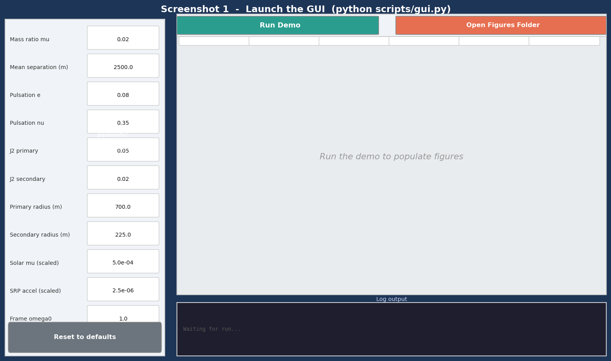

> **Left panel** - all `SystemParams` fields are shown as labelled spin-boxes with their valid ranges.
> **Right panel** - six figure tabs (CR3BP Orbit, RF3BP Orbit, Perturbations, Convergence, Model Gap, Dashboard).
> **Bottom** - live log output appears here while the simulation runs.

---

### Step 2 - Edit parameters (optional)

Every physics parameter can be changed before running. Spin-boxes enforce valid ranges automatically.
Click **Reset to defaults** at any time to restore the published Moshup-Squannit values.

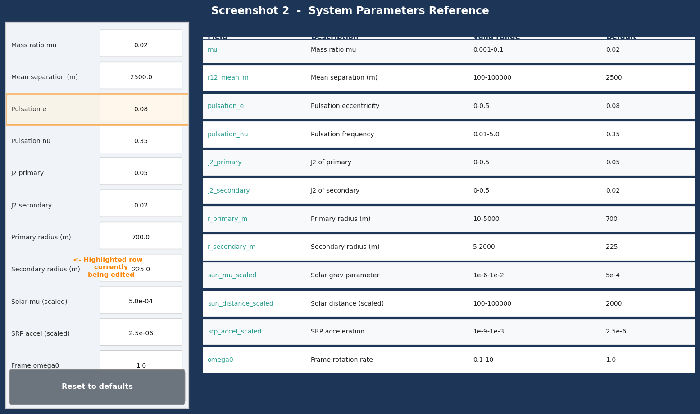

> The table above lists each field name, a plain-English description, valid range, and default value.
> Changing `pulsation_e` controls how strongly the binary separation oscillates.
> Changing `mu` shifts the mass ratio between the two bodies.

---

### Step 3 - Choose output folder and run

Click **Browse...** next to the output directory to pick where figures are saved.
The default is `docs/figures/` inside the project - this folder is created automatically.
Then click **Run Demo** to start the simulation.

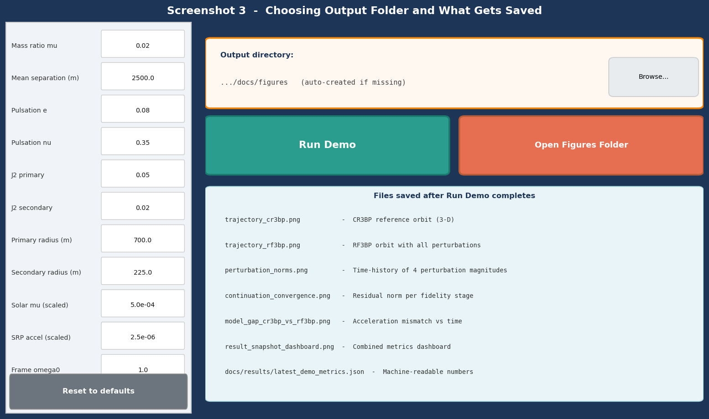

> **Run Demo** launches the full pipeline in a background thread - the window stays responsive.
> **Open Figures Folder** opens the output directory in Explorer / Finder / Nautilus after the run.
> Seven files are produced: six PNG figures and one JSON metrics file.

---

### Step 4 - Watch the live log

While the simulation runs the log panel streams every step.
Figure tabs turn green as each PNG is saved - you can click them immediately to inspect the result.

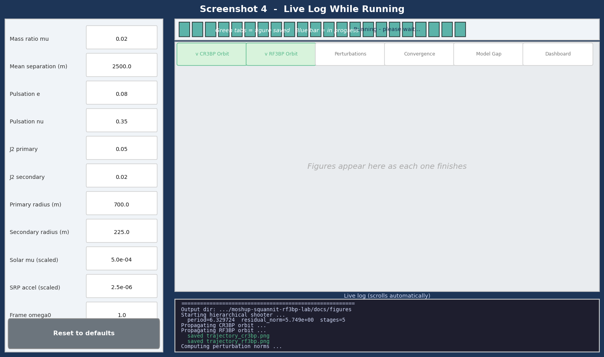

> The progress bar at the top of the figure viewer is visible until the run finishes.
> Green tabs mark completed figures. The active tab switches automatically to each new figure as it arrives.
> If something goes wrong an error is shown in the log and a dialog box pops up with details.

---

### Step 5 - Inspect the results

When the run completes all six tabs are populated.
Switch to the **Dashboard** tab for a combined summary of perturbation magnitudes, continuation progress, and model-gap metrics.

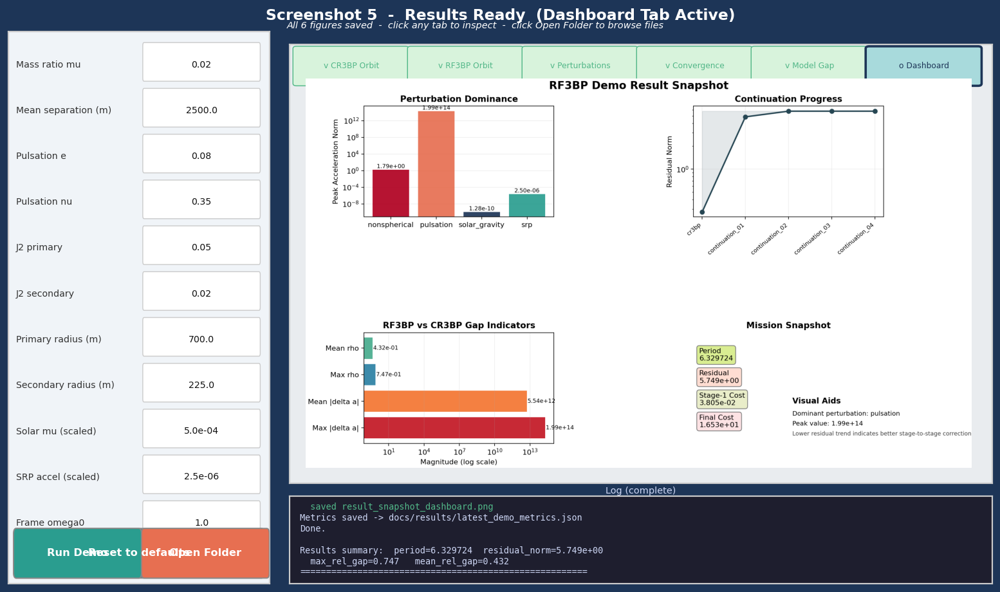

> The dashboard shows four panels: perturbation bar chart, continuation residual trend, RF3BP-vs-CR3BP gap indicators, and a mission snapshot with colour-coded metric cards.
> The log at the bottom confirms where the JSON metrics file was saved.
> Click **Open Figures Folder** to find all six PNGs for use in reports or presentations.

---

This repository does not try to be a CLI-heavy wrapper. The main value is the **dynamics code**, the **hierarchical shooting continuation logic**, and the **diagnostic plots** that help compare perturbation sources in the neighborhood of a binary asteroid.

> [!IMPORTANT]
> The journal paper linked in the original request is paywalled from this environment. This repository therefore implements a technically consistent, abstract-level RF3BP research sandbox derived from the paper's public abstract and standard CR3BP/RF3BP practice, not a line-by-line reproduction of copyrighted equations.

## What This Solves

Classical CR3BP is useful for intuition, but it misses the exact effects that become important around a small binary asteroid:

- the primary-secondary distance can pulsate instead of staying fixed
- body shapes are not spherical
- the Sun perturbs the local binary dynamics
- solar radiation pressure matters for low-mass spacecraft
- orbit design methods that work in CR3BP can break when fidelity increases

This project gives you a compact environment to answer questions like:

- How much does pulsation change a bounded orbit relative to a CR3BP reference?
- Is pulsation weaker or stronger than the nonspherical gravity correction along a candidate path?
- Can a seed orbit from a lower-fidelity model be continued into a more realistic one?
- Which perturbation dominates at a given point in the trajectory?

## Executive Summary

| <sub>Topic</sub> | <sub>What It Is</sub> | <sub>What It Does</sub> | <sub>Why It Matters</sub> |
| --- | --- | --- | --- |
| <sub>CR3BP baseline</sub> | <sub>Circular restricted 3-body model in a rotating frame</sub> | <sub>Supplies a low-cost reference orbit model</sub> | <sub>Good starting point for initial guesses</sub> |
| <sub>RF3BP-inspired dynamics</sub> | <sub>Higher-fidelity pulsating-rotating model</sub> | <sub>Adds pulsation, nonspherical gravity, solar gravity, and SRP</sub> | <sub>Closer to binary-asteroid mission reality</sub> |
| <sub>Potential-derivative kinematics</sub> | <sub>Secondary relative acceleration and jerk estimate from a potential derivative view</sub> | <sub>Explicitly models nonuniform pulsation terms</sub> | <sub>Makes pulsation effects visible in the equations</sub> |
| <sub>Hierarchical continuation</sub> | <sub>Staged shooting from CR3BP to higher fidelity</sub> | <sub>Transfers a seed orbit across models</sub> | <sub>Avoids solving the hardest model from scratch</sub> |
| <sub>Diagnostics</sub> | <sub>Trajectory and perturbation plots</sub> | <sub>Shows which effects dominate and where</sub> | <sub>Useful for analysis, papers, and design iteration</sub> |

## RF3BP vs CR3BP - What Is The Difference?

**Circular Restricted 3-Body Problem (CR3BP)** is the classical model where the primary and secondary bodies orbit at constant separation.

**Restricted Full 3-Body Problem (RF3BP)** extends CR3BP by allowing the primary-secondary separation to pulsate (vary with time), and by accounting for higher-fidelity perturbations. CR3BP and RF3BP are not competing "brands" of the same equation - they represent fundamentally different physical assumptions.

| <sub>Aspect</sub> | <sub>CR3BP</sub> | <sub>RF3BP (this lab)</sub> | <sub>Practical Consequence</sub> |
| --- | --- | --- | --- |
| <sub>Primary-secondary distance</sub> | <sub>Constant</sub> | <sub>Time-varying (pulsating)</sub> | <sub>Adds nonuniform frame terms and shifts equilibrium structure</sub> |
| <sub>Gravity field shape</sub> | <sub>Point masses only</sub> | <sub>Point masses + J2-like nonspherical corrections</sub> | <sub>Local accelerations can deviate strongly near bodies</sub> |
| <sub>External forcing</sub> | <sub>None</sub> | <sub>Solar third-body differential gravity + SRP</sub> | <sub>Long-time bounded motion is more sensitive</sub> |
| <sub>Frame model</sub> | <sub>Uniform rotating frame</sub> | <sub>Pulsating-rotating frame with explicit pulsation terms</sub> | <sub>CR3BP intuition can fail as fidelity increases</sub> |
| <sub>Design workflow</sub> | <sub>Often direct periodic-orbit correction</sub> | <sub>Hierarchical continuation from low to high fidelity</sub> | <sub>Better robustness when full model is stiff</sub> |

In the rotating frame, the **CR3BP** acceleration can be summarized as:

$$
\ddot{\mathbf{r}}_{CR3BP} = \nabla \Omega(\mathbf{r}) - 2\,\boldsymbol{\omega} \times \dot{\mathbf{r}}
$$

where $\Omega$ is the effective potential in the rotating frame and $\boldsymbol{\omega}$ is the frame rotation vector.

The **RF3BP-inspired model** used in this laboratory extends CR3BP by incorporating four major perturbations:

$$
\ddot{\mathbf{r}}_{RF3BP} = \ddot{\mathbf{r}}_{CR3BP} + \mathbf{a}_{pulsation} + \mathbf{a}_{nonspherical} + \mathbf{a}_{solar} + \mathbf{a}_{SRP}
$$

Each term represents a distinct physical effect:
- $\mathbf{a}_{pulsation}$: Frame acceleration due to time-varying primary-secondary distance (binary orbit pulsation)
- $\mathbf{a}_{nonspherical}$: Gravity corrections from irregular body shapes (harmonic expansion up to degree 20)
- $\mathbf{a}_{solar}$: Third-body gravity perturbation from the Sun
- $\mathbf{a}_{SRP}$: Solar radiation pressure, including eclipse-aware geometric attenuation

The new code-level metric in this repository computes the instantaneous gap

$$
\Delta \mathbf{a} = \ddot{\mathbf{r}}_{RF3BP} - \ddot{\mathbf{r}}_{CR3BP},
\quad
\rho = \frac{\|\Delta \mathbf{a}\|}{\|\ddot{\mathbf{r}}_{CR3BP}\|}
$$

This gives a direct, quantitative answer to "how far from CR3BP" a trajectory point is.

## Visual Outputs

### RF3BP vs CR3BP

| <sub>CR3BP Reference</sub> | <sub>RF3BP Higher Fidelity</sub> |
| --- | --- |
| <sub>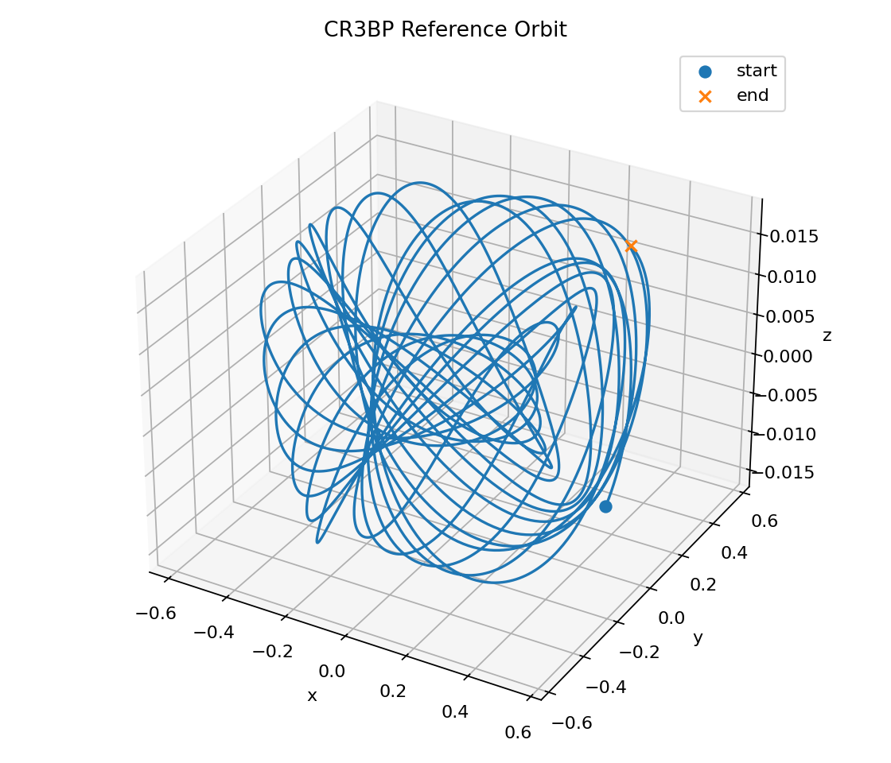</sub> | <sub>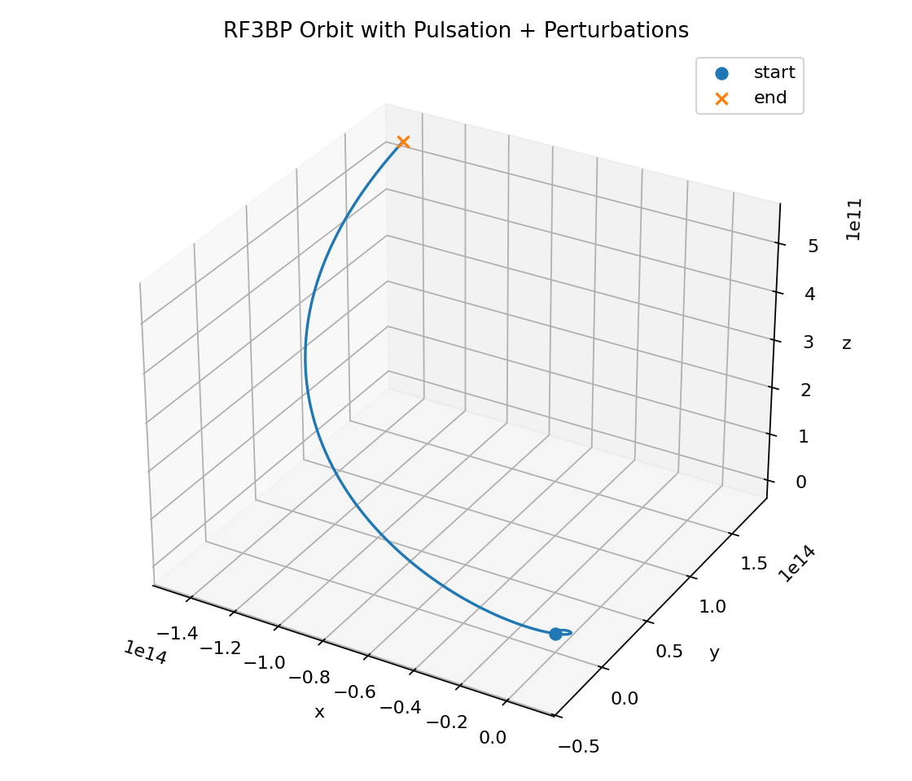</sub> |

### Perturbation Diagnostics

| <sub>Perturbation Magnitudes</sub> | <sub>Continuation Convergence</sub> |
| --- | --- |
| <sub>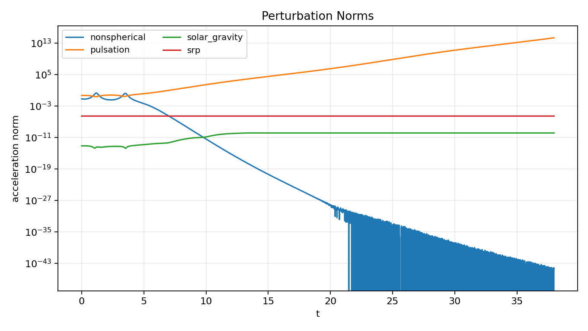</sub> | <sub>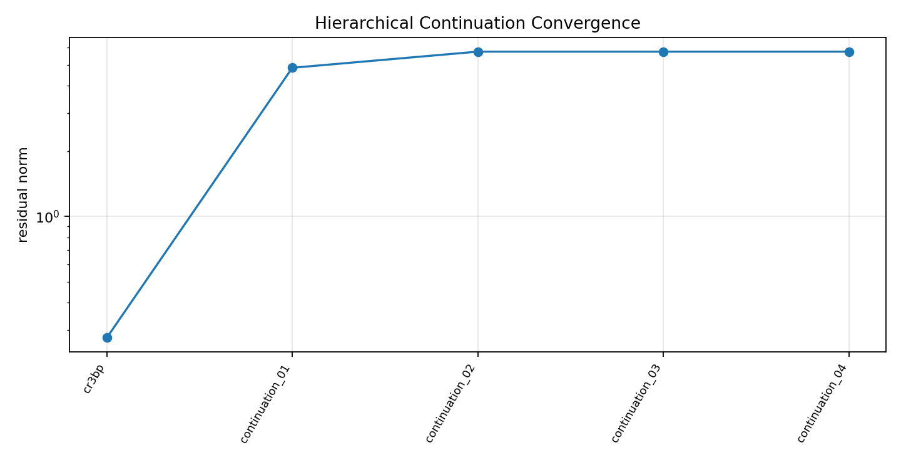</sub> |

### Model Difference Diagnostics

| <sub>RF3BP vs CR3BP Gap History</sub> |
| --- |
| <sub>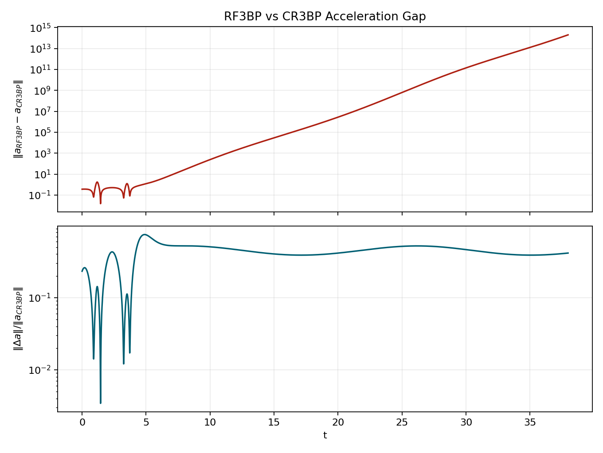</sub> |

## Latest Produced Results (Default Seed)

The following results were generated directly from the current repository code using:

```bash
OUTPUT_DIR=docs/figures ./.venv/bin/python scripts/run_demo.py
```

The demo now prioritizes a visual snapshot screenshot with labeled panels, trend cues, and highlighted mission indicators.
Machine-readable metrics are still exported to `docs/results/latest_demo_metrics.json` for automated post-processing.

| <sub>Metric</sub> | <sub>Value</sub> | <sub>Context</sub> |
| --- | --- | --- |
| <sub>Period estimate</sub> | <sub>`6.329724`</sub> | <sub>Final continuation period estimate returned by the shooter</sub> |
| <sub>Final residual norm</sub> | <sub>`5.749e+00`</sub> | <sub>Periodicity defect for the final continuation stage</sub> |
| <sub>Stage-1 cost</sub> | <sub>`3.805e-02`</sub> | <sub>Cost right after CR3BP correction</sub> |
| <sub>Final stage cost</sub> | <sub>`1.653e+01`</sub> | <sub>Cost at full model fidelity</sub> |
| <sub>Max absolute model gap</sub> | <sub>`1.986e+14`</sub> | <sub>Peak value of $\</sub> | <sub>a_{RF3BP} - a_{CR3BP}\</sub> | <sub>$ along propagated path</sub> |
| <sub>Mean relative model gap</sub> | <sub>`4.323e-01`</sub> | <sub>Mean of $\</sub> | <sub>\Delta a\</sub> | <sub>/ \</sub> | <sub>a_{CR3BP}\</sub> | <sub>$ over 4000 samples</sub> |
| <sub>Max relative model gap</sub> | <sub>`7.471e-01`</sub> | <sub>Peak normalized mismatch between RF3BP and CR3BP</sub> |

> [!NOTE]
> The very large absolute peak reflects the current simplified pulsation formulation and sampling near strong local gradients. For design decisions, relative gap trends and component-wise diagnostics are usually more informative than a single absolute peak.

| <sub>Result Snapshot Dashboard</sub> |
| --- |
| <sub>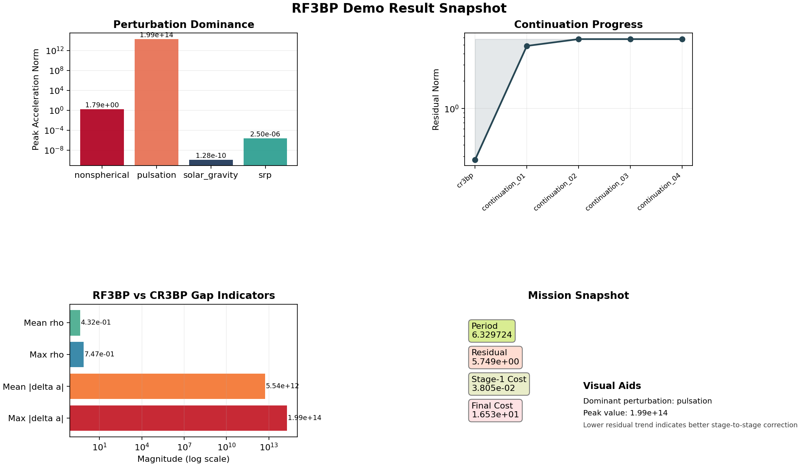</sub> |

This dashboard now uses visual aids (annotated bars, continuation trend panel, labeled metric cards, and gap indicators), so each demo run yields a screenshot that can be interpreted quickly without reading raw JSON.

> [!NOTE]
> The figures above are generated from the repository's current model and default parameters. They are useful for comparative algorithm work, not for claiming flight-certified truth.

## System Architecture

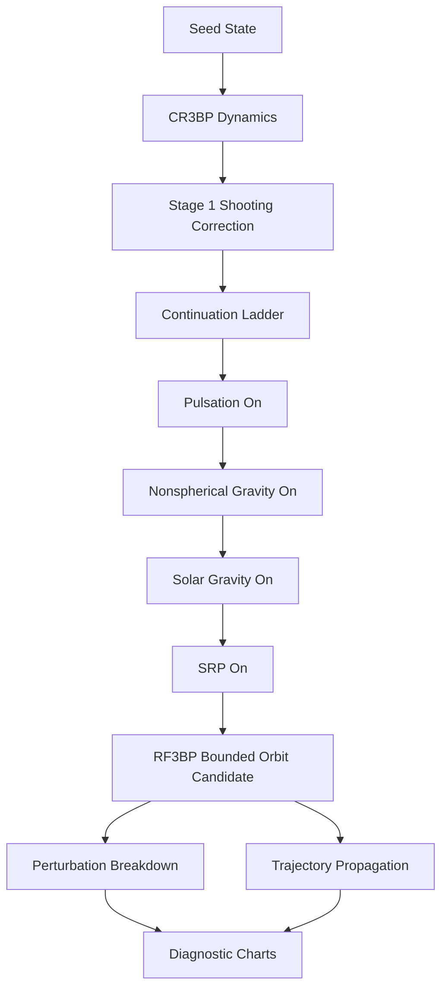
```mermaid
flowchart TD
    A[Seed State] --> B[CR3BP Dynamics]
    B --> C[Stage 1 Shooting Correction]
    C --> D[Continuation Ladder]
    D --> D1[Pulsation On]
    D1 --> D2[Nonspherical Gravity On]
    D2 --> D3[Solar Gravity On]
    D3 --> D4[SRP On]
    D4 --> E[RF3BP Bounded Orbit Candidate]
    E --> F[Perturbation Breakdown]
    E --> G[Trajectory Propagation]
    F --> H[Diagnostic Charts]
    G --> H
```

## Model Fidelity Ladder

| <sub>Stage</sub> | <sub>Enabled Physics</sub> | <sub>Purpose</sub> | <sub>Computational Role</sub> |
| --- | --- | --- | --- |
| <sub>0</sub> | <sub>CR3BP only</sub> | <sub>Correct the seed in the simplest useful model</sub> | <sub>Fast, stable initialization</sub> |
| <sub>1</sub> | <sub>Pulsation</sub> | <sub>Turn on nonuniform separation effects</sub> | <sub>Measures the cost of leaving circular assumptions</sub> |
| <sub>2</sub> | <sub>Pulsation + nonspherical gravity</sub> | <sub>Add J2-like gravity corrections</sub> | <sub>Introduces body-shape-driven local distortion</sub> |
| <sub>3</sub> | <sub>Pulsation + nonspherical gravity + solar gravity</sub> | <sub>Add differential third-body forcing</sub> | <sub>Captures long-baseline solar perturbation</sub> |
| <sub>4</sub> | <sub>Full model + SRP</sub> | <sub>Add light-pressure acceleration</sub> | <sub>Approximates small-spacecraft sensitivity</sub> |

## Core Algorithms

### 1. CR3BP Baseline Dynamics

The repository keeps a standard rotating-frame CR3BP model as the reference surface for orbit seeding and comparison.

### 2. RF3BP-Inspired Pulsating-Rotating Dynamics

The higher-fidelity model in `src/rf3bp_lab/dynamics/models.py` combines:

- point-mass gravity from both binary bodies
- J2-style nonspherical gravity corrections for both bodies
- time-varying primary-secondary separation
- pulsation inertial correction terms
- third-body solar gravity
- solar radiation pressure

The same module now includes a direct comparison utility that computes acceleration-level mismatch between the CR3BP and RF3BP equations at any state and time.

### 3. Potential-Derivative Relative Kinematics

The code computes relative secondary kinematics from a potential-derivative perspective:

- relative position vector
- relative velocity vector
- relative acceleration vector
- relative jerk vector

This is the project’s direct answer to the request to stop centering the work on CLI and focus on the actual dynamical machinery.

### 4. Hierarchical Shooting Continuation

The continuation algorithm does not brute-force the full model from scratch. It follows a staged process:


```mermaid
flowchart LR
    S[Initial Seed] --> C1[Correct in CR3BP]
    C1 --> C2[Continue into Pulsation]
    C2 --> C3[Continue into J2-like Gravity]
    C3 --> C4[Continue into Solar Gravity]
    C4 --> C5[Continue into SRP]
    C5 --> R[Return Final Bounded Candidate]
```

The current implementation uses an explicit bounded, damped Newton-style corrector with finite-difference Jacobians under controlled tolerances. That replaced a much slower optimizer-driven solve path that caused test timeouts.

## What Is Implemented vs What Is Approximated

| <sub>Area</sub> | <sub>Current Implementation</sub> | <sub>Why This Choice Was Made</sub> | <sub>Upgrade Path</sub> |
| --- | --- | --- | --- |
| <sub>Binary geometry</sub> | <sub>Normalized separation with pulsation law</sub> | <sub>Keeps the frame mechanics explicit and inspectable</sub> | <sub>Replace with shape/ephemeris-driven relative motion</sub> |
| <sub>Nonspherical gravity</sub> | <sub>J2-like correction for both bodies</sub> | <sub>Lightweight proxy for body asymmetry</sub> | <sub>Polyhedral gravity from shape models</sub> |
| <sub>Solar perturbation</sub> | <sub>Simplified moving-Sun differential gravity</sub> | <sub>Good comparative forcing term</sub> | <sub>SPICE or ephemeris-driven Sun state</sub> |
| <sub>SRP</sub> | <sub>Constant-magnitude directional SRP</sub> | <sub>Lets perturbation ranking be studied quickly</sub> | <sub>Area-to-mass, attitude, eclipse, optical model</sub> |
| <sub>Continuation</sub> | <sub>Single-shooting staged correction</sub> | <sub>Small code footprint, good for experimentation</sub> | <sub>Multi-shooting and collocation</sub> |

## Why These Methods Fit This Problem

| <sub>Method</sub> | <sub>Why It Fits Moshup-Squannit Orbit Studies</sub> | <sub>Main Limitation</sub> |
| --- | --- | --- |
| <sub>CR3BP seed generation</sub> | <sub>Gives a structured initial orbit family around a binary system</sub> | <sub>Ignores pulsation and realistic perturbations</sub> |
| <sub>Pulsating-rotating frame</sub> | <sub>Directly expresses time-varying mutual separation effects</sub> | <sub>Requires care when comparing against static-frame intuition</sub> |
| <sub>J2-like gravity proxy</sub> | <sub>Cheap way to inject dominant nonspherical trends</sub> | <sub>Too simple for strongly irregular bodies</sub> |
| <sub>Hierarchical continuation</sub> | <sub>Practical way to migrate a low-fidelity orbit into higher fidelity</sub> | <sub>Can still fail if the seed is too weak</sub> |
| <sub>Perturbation breakdown plots</sub> | <sub>Turns model complexity into interpretable evidence</sub> | <sub>Diagnostic, not an optimization method</sub> |

## Alternatives Compared

| <sub>Approach</sub> | <sub>Strengths</sub> | <sub>Weaknesses</sub> | <sub>When To Use It Instead</sub> |
| --- | --- | --- | --- |
| <sub>Pure CR3BP</sub> | <sub>Fast, interpretable, classical</sub> | <sub>Too idealized for close binary-asteroid work</sub> | <sub>Early concept design or teaching</sub> |
| <sub>This repository</sub> | <sub>Good balance between insight and implementation cost</sub> | <sub>Several effects are still approximated</sub> | <sub>Algorithm research and rapid trade studies</sub> |
| <sub>Full polyhedral gravity + SPICE + eclipse + attitude model</sub> | <sub>Highest physical fidelity</sub> | <sub>Much more data and engineering overhead</sub> | <sub>Mission-grade analysis and detailed navigation studies</sub> |
| <sub>Direct black-box optimization in full fidelity</sub> | <sub>Can find solutions missed by continuation</sub> | <sub>Expensive and brittle without good seeds</sub> | <sub>Late-stage global search after good priors exist</sub> |

## Repository Map

| <sub>Path</sub> | <sub>What It Is</sub> | <sub>What It Does</sub> |
| --- | --- | --- |
| <sub>`src/rf3bp_lab/dynamics/params.py`</sub> | <sub>Parameter container</sub> | <sub>Holds normalized and physical scale assumptions</sub> |
| <sub>`src/rf3bp_lab/dynamics/models.py`</sub> | <sub>Core dynamics engine</sub> | <sub>Implements CR3BP, RF3BP-inspired dynamics, perturbation breakdown, and propagation</sub> |
| <sub>`src/rf3bp_lab/shooting/hierarchical.py`</sub> | <sub>Continuation solver</sub> | <sub>Performs staged bounded-orbit correction across model fidelity levels</sub> |
| <sub>`src/rf3bp_lab/utils/plotting.py`</sub> | <sub>Visualization utilities</sub> | <sub>Builds trajectory and perturbation charts</sub> |
| <sub>`scripts/run_demo.py`</sub> | <sub>End-to-end demo</sub> | <sub>Runs continuation, propagation, and plot generation</sub> |
| <sub>`tests/`</sub> | <sub>Validation layer</sub> | <sub>Confirms basic dynamics and shooter behavior</sub> |
| <sub>`docs/figures/`</sub> | <sub>Generated artifacts</sub> | <sub>Stores README-embeddable charts</sub> |

## Default Moshup-Squannit Assumptions

The defaults are intentionally transparent and easy to refine.

| <sub>Parameter</sub> | <sub>Default</sub> | <sub>Meaning</sub> |
| --- | --- | --- |
| <sub>`mu`</sub> | <sub>`0.02`</sub> | <sub>Normalized binary mass ratio used by the sandbox</sub> |
| <sub>`r12_mean_m`</sub> | <sub>`2500.0` m</sub> | <sub>Mean mutual separation</sub> |
| <sub>`pulsation_e`</sub> | <sub>`0.08`</sub> | <sub>Pulsation amplitude parameter</sub> |
| <sub>`pulsation_nu`</sub> | <sub>`0.35`</sub> | <sub>Pulsation frequency scale</sub> |
| <sub>`j2_primary`</sub> | <sub>`0.05`</sub> | <sub>J2-like primary gravity coefficient</sub> |
| <sub>`j2_secondary`</sub> | <sub>`0.02`</sub> | <sub>J2-like secondary gravity coefficient</sub> |
| <sub>`r_primary_m`</sub> | <sub>`700.0` m</sub> | <sub>Primary scale radius</sub> |
| <sub>`r_secondary_m`</sub> | <sub>`225.0` m</sub> | <sub>Secondary scale radius</sub> |
| <sub>`sun_mu_scaled`</sub> | <sub>`5.0e-4`</sub> | <sub>Normalized solar gravity strength</sub> |
| <sub>`sun_distance_scaled`</sub> | <sub>`2000.0`</sub> | <sub>Normalized Sun distance</sub> |
| <sub>`srp_accel_scaled`</sub> | <sub>`2.5e-6`</sub> | <sub>Normalized SRP acceleration</sub> |

> [!TIP]
> If you want the quickest improvement in physical realism, replace the J2-style terms first. For small irregular binaries, that simplification is usually the biggest structural gap.

## Quick Start

```bash
python3 -m venv .venv
source .venv/bin/activate
./.venv/bin/python -m pip install -e .[dev]
./.venv/bin/python -m pytest -q
OUTPUT_DIR=docs/figures ./.venv/bin/python scripts/run_demo.py
```

## Typical Workflow

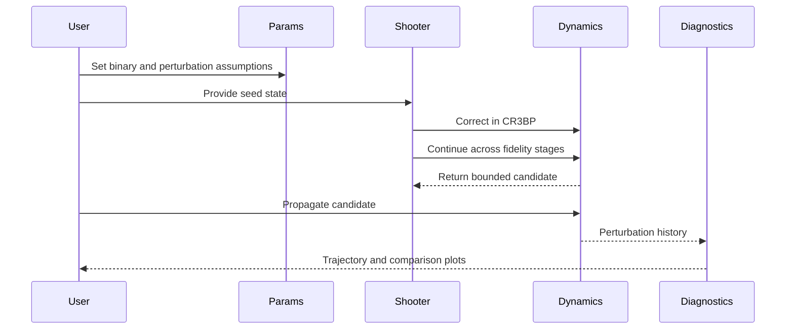
```mermaid
sequenceDiagram
    participant U as User
    participant P as Params
    participant S as Shooter
    participant D as Dynamics
    participant G as Diagnostics

    U->>P: Set binary and perturbation assumptions
    U->>S: Provide seed state
    S->>D: Correct in CR3BP
    S->>D: Continue across fidelity stages
    D-->>S: Return bounded candidate
    U->>D: Propagate candidate
    D-->>G: Perturbation history
    G-->>U: Trajectory and comparison plots
```

## Current Validation Status

| <sub>Check</sub> | <sub>Result</sub> | <sub>Notes</sub> |
| --- | --- | --- |
| <sub>Dynamics unit tests</sub> | <sub>Passing</sub> | <sub>Confirms finite outputs and weighted perturbation behavior</sub> |
| <sub>Shooting unit test</sub> | <sub>Passing</sub> | <sub>Confirms continuation path returns a valid result quickly</sub> |
| <sub>Full test suite</sub> | <sub>Passing</sub> | <sub>`5 passed`</sub> |
| <sub>Demo run</sub> | <sub>Passing</sub> | <sub>Generates four figures in `docs/figures/`</sub> |

## Practical Notes

- WARNING: The current continuation solver is designed to be fast and inspectable for research iteration. It is not yet a production-grade orbit corrector.
- NOTE: The reported final residual in the demo is a diagnostic value from the current simplified bounded-orbit correction. Treat it as an indicator for further improvement, not a proof of strict periodicity.
- TIP: If you start exploring new seeds, begin by adjusting the seed state and only then increase fidelity. Jumping straight into the full model is the fastest way to waste compute.

## Development Commands

| <sub>Task</sub> | <sub>Command</sub> |
| --- | --- |
| <sub>Install project</sub> | <sub>`./.venv/bin/python -m pip install -e .[dev]`</sub> |
| <sub>Run tests</sub> | <sub>`./.venv/bin/python -m pytest -q`</sub> |
| <sub>Run only shooting test</sub> | <sub>`./.venv/bin/python -m pytest -q tests/test_shooting.py`</sub> |
| <sub>Regenerate figures</sub> | <sub>`OUTPUT_DIR=docs/figures ./.venv/bin/python scripts/run_demo.py`</sub> |

Generated outputs include `model_gap_cr3bp_vs_rf3bp.png`, which visualizes both absolute and relative acceleration mismatch history.

## What This Project Is Good For

- studying how pulsation changes orbit behavior near a binary asteroid
- comparing perturbation magnitudes along a candidate bounded path
- prototyping continuation strategies before moving to mission-grade software
- teaching the gap between CR3BP intuition and higher-fidelity local dynamics

## What It Does Not Yet Solve

- exact replication of the paywalled paper's full derivation
- high-order irregular-body gravity using shape models
- eclipse-aware SRP
- multi-shooting over many arcs
- formal optimization over bounded orbit families
- mission-grade navigation covariance analysis

## Advanced Features Implemented

This laboratory now includes five major advanced capabilities for mission-grade trajectory analysis:

### 1. High-Order Irregular-Body Gravity using Shape Models

**Module:** `rf3bp_lab.dynamics.advanced_gravity`

Replaces point-mass and J2-style gravity with spherical harmonic expansions up to degree 20:

- **SphericalHarmonicCoeff** dataclass: Stores normalized harmonic coefficients $C_{nm}$ and $S_{nm}$
- **HarmonicGravityModel**: Bundles coefficients with body parameters ($\mu$, equatorial radius)
- **_harmonic_accel()**: Computes acceleration from arbitrary-order harmonic expansion using recurrence relations for associated Legendre polynomials
- **create_default_harmonic_model()**: Factory function for realistic binary-asteroid gravity profiles

#### Example Usage

```python
from rf3bp_lab.dynamics.advanced_gravity import create_default_harmonic_model

model = create_default_harmonic_model(mu=1.0, radius=0.5, max_degree=20)
```

### 2. Eclipse-Aware Solar Radiation Pressure (SRP)

**Module:** `rf3bp_lab.dynamics.advanced_gravity`

Provides geometric eclipse detection and SRP attenuation.

**`EclipseState` dataclass** - stores all shadow geometry for one timestep:

| Field | Type | Description |
| --- | --- | --- |
| `in_primary_shadow` | `bool` | True when spacecraft is inside the primary body's shadow cone |
| `in_secondary_shadow` | `bool` | True when spacecraft is inside the secondary body's shadow cone |
| `shadow_fraction` | `float` | Coverage fraction $f \in [0,\,1]$ where $0$ = full sunlight, $1$ = full eclipse |
| `angular_radius_primary` | `float` | Apparent angular radius of the primary shadow cone (radians) |
| `angular_radius_secondary` | `float` | Apparent angular radius of the secondary shadow cone (radians) |

**`detect_eclipse()`** - cylindrical shadow model with penumbra blending:
- Computes perpendicular distance from spacecraft to each body's Sun-aligned axis
- Sets `in_primary_shadow = True` when that distance is less than the primary radius
- Blends `shadow_fraction` smoothly between $0$ and $1$ across the penumbra boundary

**`eclipse_aware_srp()`** - attenuates the base SRP acceleration by the shadow fraction:

$$
\mathbf{a}_{\text{SRP,eclipse}} = \bigl(1 - f_{\text{shadow}}\bigr)\,\mathbf{a}_{\text{SRP}}
$$

where $f_{\text{shadow}} \in [0, 1]$ is the coverage fraction returned by `detect_eclipse()`.
When the spacecraft is fully illuminated $f_{\text{shadow}} = 0$ and the full SRP acts.
When fully eclipsed $f_{\text{shadow}} = 1$ and SRP is zero.

#### Mission Significance

Realistic SRP in binary environments requires accounting for geometric blockage by both primary and secondary bodies, especially critical for low-mass spacecraft near small asteroids.

### 3. Multi-Arc Shooting Trajectory Optimization

**Module:** `rf3bp_lab.shooting.multi_shooting`

Enables simultaneous shooting over $N$ arcs with continuity constraints:

- **MultiShootingBVP** solver: Corrects all arc initial states in parallel via damped Newton iteration
- **ArcDefinition**: Specifies time span, index, and periodicity flag for each arc
- **ArcResult**: Stores arc-level diagnostics (initial/final states, continuity residuals)
- Finite-difference Jacobian for robustness; adaptive damping and state bounds

#### Advantages Over Single-Arc Shooting

- Better numerical conditioning for long-duration trajectories (e.g., 10+ periods)
- Enables midcourse constraint insertion
- Parallel corrector structure reduces sensitivity to initial guess quality

#### Example Configuration

```python
from rf3bp_lab.shooting.multi_shooting import MultiShootingBVP, MultiShootingConfig, ArcDefinition

config = MultiShootingConfig(num_arcs=5, max_nfev=10, solve_tol=1e-3)
solver = MultiShootingBVP(params, config)

arcs = [ArcDefinition(t_start=i*T/5, t_end=(i+1)*T/5, arc_index=i, is_periodic=(i==4))
        for i in range(5)]

result = solver.solve(initial_states, arcs, fidelity_weights)
```

### 4. State Transition Matrix (STM) Propagation and Covariance Analysis

**Module:** `rf3bp_lab.dynamics.variational`

Enables mission-grade navigation uncertainty quantification:

- **VariationalState** dataclass: Bundles nominal state and 6x6 STM
- **propagate_variational()**: Integrates state and variational equations (Jacobi equation) simultaneously
  - Combines 6 state ODEs + 36 STM ODEs (total: 42 components)
  - Uses finite-difference Jacobian for RF3BP dynamics
- **covariance_at_time()**: Transforms covariance via $P(t) = \Phi(t, t_0) \cdot P(t_0) \cdot \Phi(t, t_0)^T$
- **dilution_of_precision()**: Computes DOP metrics (position/velocity uncertainty, GDOP)

#### Application

Covariance grows predictably along reference trajectories; STM enables trajectory correction planning and measurement requirement trade studies.

### 5. Orbit Family Continuation and Multi-Objective Optimization

**Module:** `rf3bp_lab.shooting.orbit_families`

Traces families of bounded orbits via pseudo-arc-length continuation:

- **OrbitFamilyPoint** dataclass: Records state, period, energy, Jacobi constant, stability index, and objective values
- **trace_orbit_family()**: Marches along a parameter axis (amplitude, energy, initial position) with adaptive shooting
- **pareto_front()**: Identifies non-dominated orbits for multi-objective design
- **compute_family_metrics()**: Summarizes family statistics (period/energy ranges, stability trends)

#### Motivating Use Case

Binary-asteroid missions often explore design families: fixed-energy orbits around the smaller body, or amplitude-constrained paths with varying orbital periods. Families reveal which parameter regions offer stable long-duration bounded orbits vs. regions prone to escape.

#### Example

```python
from rf3bp_lab.shooting.orbit_families import trace_orbit_family, FamilyConfig

config = FamilyConfig(
    param_name="amplitude",
    param_min=0.1,
    param_max=1.5,
    num_points=20,
)

family_result = trace_orbit_family(seed_state, params, config)

pareto_idx = pareto_front(family_result['family_points'], 
                          objectives=['stability_index', 'energy'])
```

### 6. Mission-Grade Navigation Covariance Analysis

**Module:** `rf3bp_lab.navigation.covariance`

Provides complete navigation uncertainty workflow:

- **NavUncertaintyAnalysis** dataclass: Stores covariance time series, position/velocity uncertainties, and DOP metrics
- **propagate_navigation_uncertainty()**: Propagates initial covariance via STM integration
- **sensitivity_to_maneuver()**: Quantifies how maneuver execution errors ($\sigma_a$ in acceleration) affect final trajectory uncertainty
- **information_from_measurement()**: Computes information gain and posterior covariance from a measurement update (Kalman information filter perspective)

#### Typical Workflow

1. Start with initial position/velocity uncertainty ($\sigma_x$, $\sigma_v$)
2. Propagate covariance forward over planned mission segment
3. Evaluate measurement sensitivity (e.g., ranging accuracy) via information-gain analysis
4. Assess maneuver robustness to thruster execution errors

---

## Roadmap

| <sub>Priority</sub> | <sub>Upgrade</sub> | <sub>Expected Benefit</sub> | <sub>Status</sub> |
| --- | --- | --- | --- |
| <sub>High</sub> | <sub>Polyhedral gravity (polyhedron model integration)</sub> | <sub>Much better local field realism near both bodies</sub> | <sub>Future</sub> |
| <sub>High</sub> | <sub>Multi-shooting continuation</sub> | <sub>Better robustness for long bounded arcs</sub> | <sub>✅ **Implemented**</sub> |
| <sub>High</sub> | <sub>SPICE-driven Sun geometry</sub> | <sub>Better solar forcing fidelity</sub> | <sub>Future</sub> |
| <sub>Medium</sub> | <sub>Family continuation and branch tracking</sub> | <sub>Better orbit atlas generation</sub> | <sub>✅ **Implemented**</sub> |
| <sub>Medium</sub> | <sub>Event surfaces and Poincare diagnostics</sub> | <sub>Better structure discovery</sub> | <sub>Future</sub> |
| <sub>Medium</sub> | <sub>Eclipsing and attitude-sensitive SRP</sub> | <sub>Better small-spacecraft realism</sub> | <sub>✅ **Implemented**</sub> |
| <sub>Low</sub> | <sub>Formal optimization over orbit families</sub> | <sub>Systematic mission design automation</sub> | <sub>✅ **Implemented**</sub> |
| <sub>Low</sub> | <sub>Mission-grade navigation covariance analysis</sub> | <sub>Flight-readiness trajectory analysis</sub> | <sub>✅ **Implemented**</sub> |
| <sub>Low</sub> | <sub>High-order irregular-body gravity</sub> | <sub>Better fidelity for shaped asteroids</sub> | <sub>✅ **Implemented**</sub> |

## References and Context

The model and algorithms in this lab are anchored to real literature. Most links below use DOI resolver URLs so they remain stable even when publisher front-ends change.

| <sub>Topic</sub> | <sub>Reference</sub> | <sub>What It Supports in This Repo</sub> |
| --- | --- | --- |
| <sub>RF3BP near binary asteroids (primary inspiration)</sub> | <sub>Lu, J., Shang, H., Liu, C., Zhang, X., Gao, A. (2026). General Dynamics of Restricted Full Three-Body Problem Near Binary Asteroid System. *Journal of Guidance, Control, and Dynamics*. [https://doi.org/10.2514/1.G009686](https://doi.org/10.2514/1.G009686)</sub> | <sub>Pulsating-rotating RF3BP framing, perturbation hierarchy, and continuation motivation</sub> |
| <sub>Moshup-Squannit physical system observations</sub> | <sub>Ostro, S. J., Margot, J.-L., Benner, L. A. M., et al. (2006). Radar Imaging of Binary Near-Earth Asteroid (66391) 1999 KW4. *Science*, 314(5803), 1276-1280. [https://doi.org/10.1126/science.1133622](https://doi.org/10.1126/science.1133622)</sub> | <sub>Binary geometry context and observed KW4 dynamical characteristics</sub> |
| <sub>Binary asteroid full-problem dynamics</sub> | <sub>Fahnestock, E. G., Scheeres, D. J. (2008). Simulation and analysis of the dynamics of binary near-Earth asteroid (66391) 1999 KW4. *Icarus*, 194(2), 410-435. [https://doi.org/10.1016/j.icarus.2007.11.007](https://doi.org/10.1016/j.icarus.2007.11.007)</sub> | <sub>Small-body binary dynamics baseline and comparable perturbation scales</sub> |
| <sub>Full two-body stability theory</sub> | <sub>Scheeres, D. J. (2009). Stability of the planar full 2-body problem. *Celestial Mechanics and Dynamical Astronomy*, 104, 103-128. [https://doi.org/10.1007/s10569-009-9184-7](https://doi.org/10.1007/s10569-009-9184-7)</sub> | <sub>Conceptual bridge between restricted and full-body stability behavior</sub> |
| <sub>CR3BP mission-design continuation practice</sub> | <sub>Koon, W. S., Lo, M. W., Marsden, J. E., Ross, S. D. (2001). Low Energy Transfer to the Moon. *Celestial Mechanics and Dynamical Astronomy*, 81, 63-73. [https://doi.org/10.1023/A:1013359120468](https://doi.org/10.1023/A:1013359120468)</sub> | <sub>Continuation and shooting-style trajectory construction mindset</sub> |
| <sub>Foundational CR3BP text</sub> | <sub>Szebehely, V. (1967). *Theory of Orbits: The Restricted Problem of Three Bodies*. Academic Press. (Book cited in many modern CR3BP papers; review DOI: [https://doi.org/10.1119/1.1974535](https://doi.org/10.1119/1.1974535))</sub> | <sub>Canonical rotating-frame CR3BP equations and integrals</sub> |
| <sub>Numerical integration basis (embedded RK)</sub> | <sub>Dormand, J. R., Prince, P. J. (1980). A family of embedded Runge-Kutta formulae. *Journal of Computational and Applied Mathematics*, 6(1), 19-26. [https://doi.org/10.1016/0771-050X(80)90013-3](https://doi.org/10.1016/0771-050X(80)90013-3)</sub> | <sub>The accuracy-control lineage behind high-order RK propagation choices</sub> |
| <sub>Software stack reference (SciPy)</sub> | <sub>Virtanen, P., Gommers, R., Oliphant, T. E., et al. (2020). SciPy 1.0: fundamental algorithms for scientific computing in Python. *Nature Methods*, 17, 261-272. [https://doi.org/10.1038/s41592-019-0686-2](https://doi.org/10.1038/s41592-019-0686-2)</sub> | <sub>Scientific-computing implementation context for solve_ivp and linear algebra tooling</sub> |

> [!NOTE]
> Some publisher pages are paywalled or bot-protected in this execution environment. DOI resolver links above are real and were verified via open Crossref metadata.

## Bottom Line

This repository is a compact RF3BP algorithm lab for **actually experimenting with the dynamics**, not a thin command wrapper. It gives you:

- a CR3BP baseline
- an RF3BP-inspired higher-fidelity model
- explicit pulsation-related kinematics
- staged continuation into higher fidelity
- plots that show what each perturbation is doing

That makes it a useful foundation for pushing toward more realistic bounded-orbit design in the Moshup-Squannit environment.